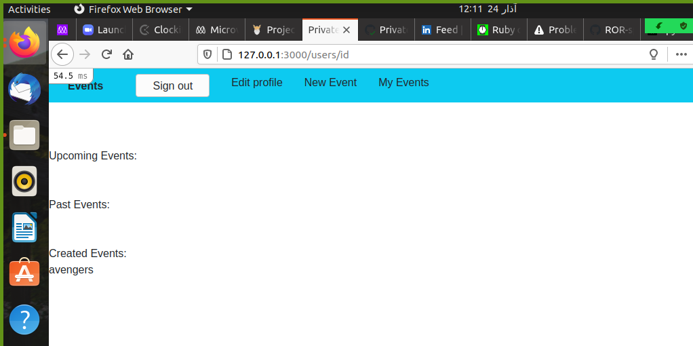

# Authentication

> Rails project to demonstrate associations, when you log in you can  create new events or attend new events, and events are sorted in upcoming and past events.

## Built With

- Ruby
- Rails
- Rubocop
- VSCode

## Getting Started

### Setup

- Open terminal
- Run "git clone https://github.com/apricot12/private-events.git"
- cd into private-events
- run "bundle install" to get all required gems
- run "rails db:migrate"
- run "rails server"

### Testing

Testing is done with rspec and capybara. To run tests, simply do the following :

- Run "bundle exec rspec". This will run all the tests
- If you want to run individual tests, simply provide a relative path, example : "bundle exec rspec ./spec/features/atten_event_spec.rb

## Authors

👤 **Author1**

- GitHub: [@apricot12](https://github.com/apricot12)
- Twitter: [@apricotfoxtrot](https://twitter.com/apricotfoxtrot)
- LinkedIn: [LinkedIn](https://linkedin.com/in/aprikot-web)

👤 **Author2**

- GitHub: [@arikarim](https://github.com/arikarim)
- Twitter: [@Ari71549490](https://twitter.com/Ari71549490)

## 🤝 Contributing

Contributions, issues, and feature requests are welcome!

Feel free to check the [issues page](https://github.com/apricot12/private-events/issues).

## Show your support

Give a ⭐️ if you like this project!

## Acknowledgments

- Hat tip to anyone whose code was used
- Inspiration
- etc

